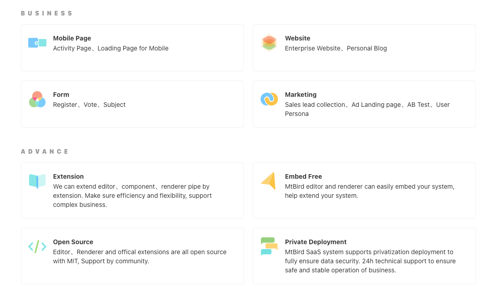

  <a href="https://mtbird.staringos.com?f=mbrm">Use for free</a> | <a href="https://staringos.com?f=mbrm">Website</a> ｜ <a href="https://docs.staringos.com?f=mbrm">Docs</a> ｜ <a href="/story/demos-编辑器--form-page">
    Demo
  </a>｜ <a href="https://github.com/staringos">Github</a>

 

# MtBird

StaringOS MtBird is a low-code platform for HTML Page、Website. We help use to build page without code or less code. It also support Wechat Mini-Program

[中文文档](./README-CN.md)

## Getting Start

- 📃 Bind your domain name [Bind Domain](https://docs.staringos.com/?path=/docs/%E7%BC%96%E8%BE%91%E5%99%A8-%E7%BB%91%E5%AE%9A%E5%9F%9F%E5%90%8D--page)

- 🌟 Develop mtbird extension [Getting Start](https://docs.staringos.com/?path=/docs/%E6%8B%93%E5%B1%95-%E4%BB%8B%E7%BB%8D--page)

- ⌚️ Emb Editor in your project or SaaS service [Embed Editor](https://docs.staringos.com/?path=/docs/%E7%BC%96%E8%BE%91%E5%99%A8-%E5%B5%8C%E5%85%A5%E7%BC%96%E8%BE%91%E5%99%A8--page)

- 🌺 Know how to embed MtBird Renderer [Embed Renderer](https://docs.staringos.com/?path=/docs/%E6%B8%B2%E6%9F%93%E5%99%A8-%E5%B5%8C%E5%85%A5%E6%B8%B2%E6%9F%93%E5%99%A8--page)

## Docs

- [Extension](https://docs.staringos.com/?path=/docs/%E6%8B%93%E5%B1%95-%E4%BB%8B%E7%BB%8D--page)
- [Editor](https://docs.staringos.com/?path=/docs/%E7%BC%96%E8%BE%91%E5%99%A8-%E4%BB%8B%E7%BB%8D--page)
- [Renderer](https://docs.staringos.com/?path=/docs/%E6%B8%B2%E6%9F%93%E5%99%A8-%E4%BB%8B%E7%BB%8D--page)
- [DEMO](https://docs.staringos.com/?path=/docs/demos-%E7%BC%96%E8%BE%91%E5%99%A8--form-page)
- [Contributing](https://docs.staringos.com/?path=/docs/demos-%E7%BC%96%E8%BE%91%E5%99%A8--form-page)
- [APIs](https://docs.staringos.com/?path=/docs/apis-%E6%95%B0%E6%8D%AE%E7%BB%93%E6%9E%84-%E7%BB%84%E4%BB%B6--page)
- [Contact Us](https://docs.staringos.com/?path=/docs/%E6%9C%8D%E5%8A%A1-%E8%81%94%E7%B3%BB%E6%88%91%E4%BB%AC--page)

## Contributing

PRs & Issues are all welcome, feel free to ask question or submit your code.

[CONTRIBUTING](./CONTRIBUTING.md)
